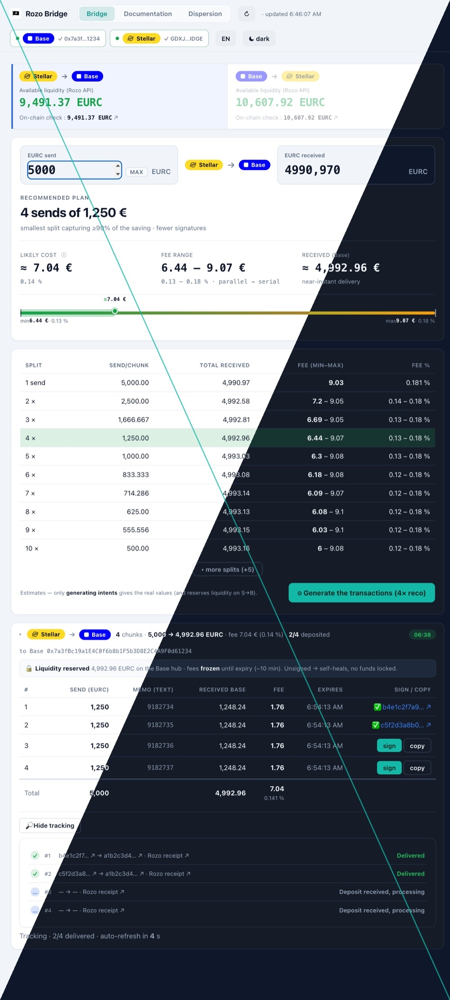

# Rozo Bridge — fee quote & split calculator

A **client-side** cost calculator for bridging **EURC between Base and Stellar** through
[Rozo](https://intents.rozo.ai/bridge)'s intents API. It answers the question every bridge
user actually has — *"what will this really cost me, and how do I get the best rate?"*
— with **exact, live quotes**, not a guess.

> ⚠️ **Unofficial, third-party tool.** Not affiliated with, endorsed by, or built by Rozo.
> It only reads Rozo's public API and public on-chain data — it never custodies funds. But
> it's provided **as-is, with no warranty**: amounts and destination addresses are always
> worth double-checking before signing anything. Used at the user's own risk.

<p align="center">
  
</p>
<p align="center"><sub>Same screen, both themes, split on the diagonal. Full-resolution originals: <a href="docs/img/bridge-light-full.png">light</a> · <a href="docs/img/bridge-dark-full.png">dark</a></sub></p>

## Why this exists

Rozo's fee isn't a flat rate — it depends on the amount *and* on how much liquidity is
left in the destination hub, and it moves as other people bridge. Quoting it right means
re-deriving that curve from real data, not assuming a formula. This tool does that work:

- **Exact cost, not an estimate** — every number comes from Rozo's own `dryrun` endpoint,
  already rounded to the cent. Nothing here is a formula guessing at what Rozo will charge.
- **Best-split calculator** — splitting a large transfer into smaller chunks can lower the
  average fee. The tool prices every split size and recommends the smallest one that
  captures ≥90% of the possible saving, so that 10 transactions aren't needed to save
  a few cents.
- **Live liquidity, both directions** — the hub balance is a thin, moving float, not a deep
  pool. The tool reads it live from Rozo's API and cross-checks it on-chain (Horizon /
  Base RPC), so whether an amount will even go through is known before sending.
- **Generate, sign, track** — turns the recommended split into real Rozo intents, allows
  signing each chunk with the user's own wallet (any injected EVM wallet on Base, any
  Stellar Wallets Kit wallet), and tracks delivery live until every chunk lands.
- **Zero backend, zero API key** — a static page that talks directly to Rozo's public API
  and to Stellar Horizon / Base RPC from the browser. Nothing to deploy, nothing to trust
  beyond what's readable in `assets/app.js`.

## Quick start

```bash
git clone https://github.com/actarus314/rozo-bridge.git
cd rozo-bridge/web
python3 serve.py
```
The script opens the page locally and serves `assets/`. Requires only Python 3 — no
install step, no build, no `.env`. The server stops itself once the tab is closed.

## Command-line quote

For a terminal-only workflow, `CLI/rozo-quote.sh` gives the same exact quotes and
liquidity checks without opening a browser — see [`CLI/README.md`](CLI/README.md).

```bash
CLI/rozo-quote.sh B2S 5000     # cost to receive 5000 EURC on Stellar
CLI/rozo-quote.sh liq S2B      # max bridgeable right now, Stellar → Base
```

## How the fee model works, in brief

Rozo doesn't publish a fee formula. This project reverse-engineered one from real
`dryrun` sweeps: fee% is a function of the amount **and** of `L`, the liquidity remaining
in the destination hub, rising toward a hard 0.50% cap as the hub drains. The app's
**Documentation** tab derives the full model — measurement method, formulas, and accuracy
(min is exact, max holds to ≤0.03€ across 16 real batches) — and the **Dispersion** tab
tracks how the real, generated bridges compare to the projected range over time.

## Structure

```
web/   — the app: serve.py, rozo-bridge.html, assets/ (JS/CSS + vendored Stellar wallet kit)
CLI/   — rozo-quote.sh, command-line quote script (see CLI/README.md)
data/  — runtime intent log, gitignored
```

## License

[MIT](LICENSE)

---

# Rozo Bridge — devis de frais & calculateur de découpage (français)

Un calculateur de coût **côté client** pour bridger de l'**EURC entre Base et Stellar**
via l'API intents de [Rozo](https://intents.rozo.ai/bridge). Il répond à la question que
tout utilisateur d'un bridge se pose vraiment — *« ça va me coûter combien, et comment
avoir le meilleur taux ? »* — avec des **devis exacts et live**, pas une estimation.

> ⚠️ **Outil non officiel, tiers.** Non affilié à Rozo, ni développé ni approuvé par eux.
> Il ne fait que lire l'API publique de Rozo et des données on-chain publiques — il ne
> détient jamais de fonds. Mais il est fourni **tel quel, sans garantie** : une vérification
> des montants et adresses de destination reste recommandée avant toute signature.
> Usage aux risques de l'utilisateur.

*(captures d'écran ci-dessus)*

## Pourquoi cet outil

Le frais de Rozo n'est pas un taux fixe : il dépend du montant **et** de la liquidité
restante dans le hub de destination, et il bouge à mesure que d'autres utilisateurs
bridgent. Le deviner correctement demande de re-dériver cette courbe depuis des données
réelles, pas de supposer une formule. C'est ce que fait cet outil :

- **Coût exact, pas une estimation** — chaque chiffre vient de l'endpoint `dryrun` de
  Rozo lui-même, déjà arrondi au centime. Rien ici n'est une formule qui devine ce que
  Rozo va facturer.
- **Calculateur de meilleur découpage** — fractionner un gros transfert en tranches peut
  réduire le frais moyen. L'outil chiffre chaque taille de découpage et recommande le plus
  petit qui capte ≥90 % de l'économie possible, pour ne pas signer 10 transactions pour
  gagner quelques centimes.
- **Liquidité live, dans les deux sens** — le solde du hub est un float mince et mouvant,
  pas un gros pool. L'outil le lit en live depuis l'API de Rozo et le vérifie on-chain
  (Horizon / RPC Base), pour savoir avant d'envoyer si le montant passera.
- **Générer, signer, suivre** — transforme le découpage recommandé en vrais intents Rozo,
  permet de signer chaque tranche avec son propre wallet (tout wallet EVM injecté sur
  Base, tout wallet compatible Stellar Wallets Kit), et suit la livraison en direct
  jusqu'à ce que chaque tranche arrive.
- **Zéro backend, zéro clé API** — une page statique qui parle directement à l'API
  publique de Rozo et à Stellar Horizon / RPC Base depuis le navigateur. Rien à déployer,
  rien à croire au-delà de ce qui est lisible dans `assets/app.js`.

## Démarrage rapide

```bash
git clone https://github.com/actarus314/rozo-bridge.git
cd rozo-bridge/web
python3 serve.py
```
Le script ouvre la page localement et sert `assets/`. Nécessite seulement Python 3 —
aucune installation, aucun build, aucun `.env`. Le serveur s'arrête tout seul à la
fermeture de l'onglet.

## Devis en ligne de commande

Pour un usage terminal, `CLI/rozo-quote.sh` donne les mêmes devis exacts et vérifications
de liquidité sans ouvrir de navigateur — voir [`CLI/README.md`](CLI/README.md).

```bash
CLI/rozo-quote.sh B2S 5000     # coût pour recevoir 5000 EURC sur Stellar
CLI/rozo-quote.sh liq S2B      # liquidité max bridgeable maintenant, Stellar → Base
```

## Le modèle de frais, en bref

Rozo ne publie pas de formule de frais. Ce projet en a re-dérivé une depuis des balayages
`dryrun` réels : le frais % est fonction du montant **et** de `L`, la liquidité restante
dans le hub de destination, montant vers un cap dur de 0,50 % à mesure que le hub se
draine. L'onglet **Documentation** de l'app dérive le modèle complet — méthode de mesure,
formules, précision (le min est exact, le max colle à ≤0,03 € sur 16 lots réels) — et
l'onglet **Dispersion** suit comment les bridges réellement générés se comparent à la
fourchette projetée dans le temps.

## Structure

```
web/   — l'app : serve.py, rozo-bridge.html, assets/ (JS/CSS + kit wallet Stellar vendored)
CLI/   — rozo-quote.sh, script de devis en ligne de commande (voir CLI/README.md)
data/  — log d'intents runtime, ignoré par Git
```

## Licence

[MIT](LICENSE)
